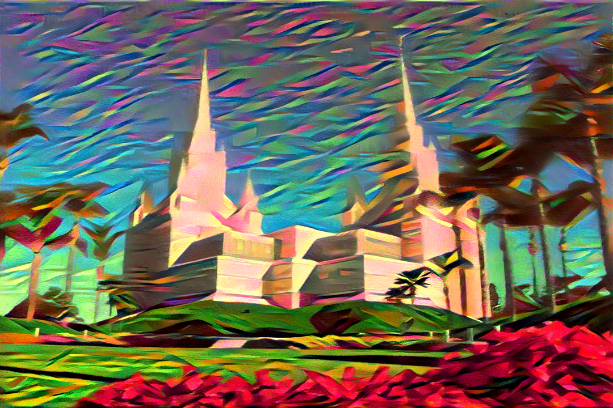
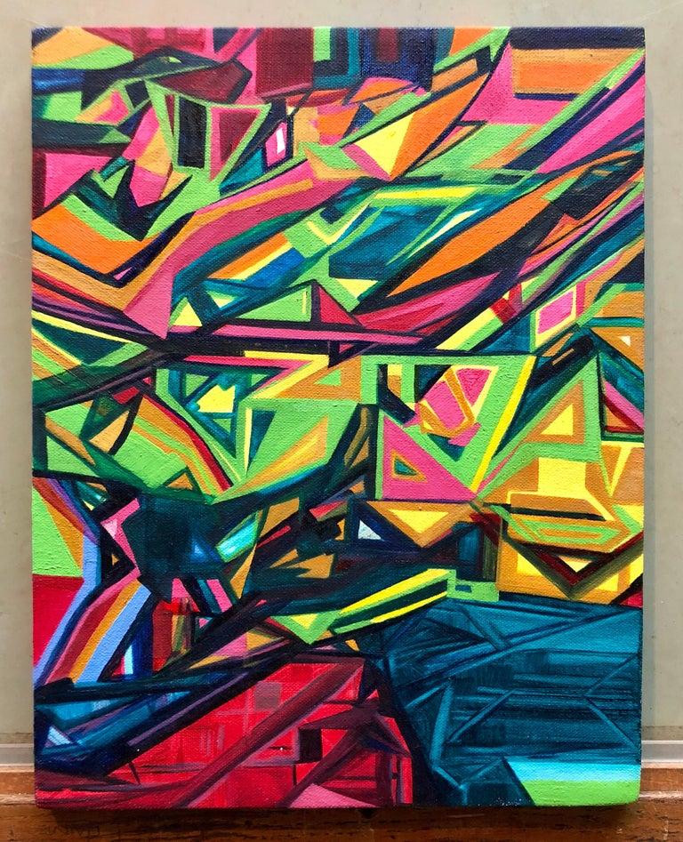

# Overview

For this project I'm doing some neural style transfer using Pytorch. I downloaded a couple of images from the internet as data for this project.
I have done things like image segmentation before with convolutional neural networks but I never got the opportunity to try anything with neural style transfer. 
Below is a video of a walkthrough of the network architecture and the code.

[Software Demo Video](http://youtube.link.goes.here)

# Data Analysis Results

Here is the result of the style transfer:

I combined this image:

with this artwork's style:

# Development Environment

I used Visual Studio Code for this project along with the Python programming language and the Pytorch deep learning library.

# Useful Websites

* [Aladdin Persson's YouTube Channel](https://www.youtube.com/channel/UCkzW5JSFwvKRjXABI-UTAkQ)

# Future Work

* style transfer more images
* make a GANs
